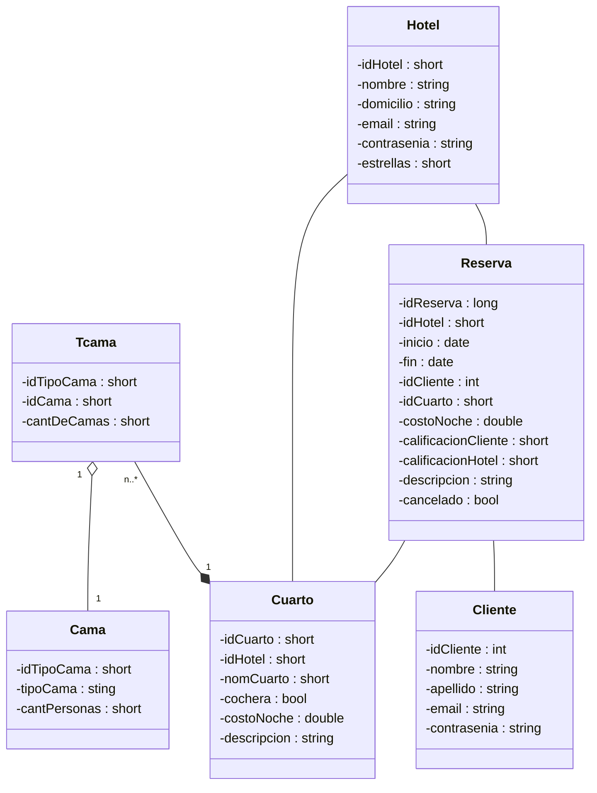

```mermaid
classDiagram
    class Hotel{
        -idHotel : short
        -nombre : string
        -domicilio : string
        -email : string
        -contrasenia : string
        -estrellas : short
    }

    class Cuarto{
        -idCuarto : short
        -idHotel : short
        -nomCuarto : short
        -cochera : bool
        -costoNoche : double
        -descripcion : string
    }

    class Tcama{
    -idTipoCama : short
    -idCama : short
    -cantDeCamas : short
}

    class Cama{
    -idTipoCama : short
    -tipoCama : sting
    -cantPersonas : short
}

    class Cliente{
        -idCliente : int
        -nombre : string
        -apellido : string
        -email : string
        -contrasenia : string
    }

    class Reserva{
        -idReserva : long
        -idHotel : short
        -inicio : date
        -fin : date
        -idCliente : int
        -idCuarto : short
        -costoNoche : double
        -calificacionCliente : short
        -calificacionHotel : short
        -descripcion : string
        -cancelado : bool
    }
    
    Hotel -- Reserva
    Reserva -- Cliente
    Hotel -- Cuarto
    Reserva -- Cuarto
    Tcama "n..*"--*"1" Cuarto
    Tcama "1"o--"1" Cama
```